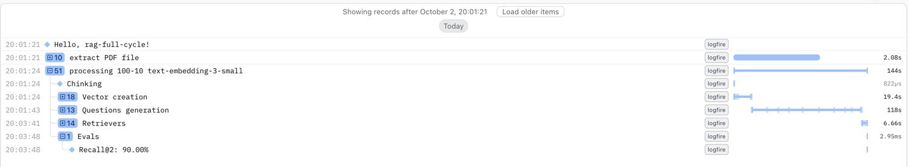

# RAG Full-Cycle Pipeline

A production-ready Retrieval-Augmented Generation (RAG) system built with modern AI technologies.



## Evaluation loop

1. Extract text from PDF
2. Create chunks with a given size/overlap
2. Build vector store with batch processing
3. Generate synthetic questions** for chunks using LLM with ThreadPoolExecutor
4. Evaluate** each config using:
    - Retrieval metrics:
        - Recall@K
        - Precision@K

## Technologies & Stack

- **Vector Database**: Pinecone for scalable similarity search
- **Embeddings**: free OLLAMA local 
- **LLM**: OLLAMA Model for question generation
- **PDF Processing**: pdfplumber for document extraction
- **Python**: Modern async/await patterns with Poetry dependency management

## Architecture

**End-to-End RAG Pipeline:**
1. **Document Processing**: PDF text extraction and intelligent chunking
2. **Vector Generation**:  embeddings with batch processing
3. **Vector Storage**: Pinecone serverless for production scalability
4. **Question Generation**: AI-powered question creation from content
5. **Retrieval Testing**: Automated similarity search validation

## Key Features

- **Multi-chunk Strategy**: Configurable chunk sizes and overlap
- **Batch Processing**: Optimized for large document sets
- **Type Safety**: Pydantic models for data validation
- **Production Ready**: Step support to allow to start from any step, error recovery, monitoring with logfire

## Quick Start

1. Set OPENAI_API_KEY PINECONE_API_KEY LOGFIRE_API_KEY in your environment
2. Download https://ollama.com/ 
3. pull all-minilm and mistral:latest models from ollama
4. poetry install && poetry run pipeline

You can run with baby book or by10syb report. You can speciy step or not steps ru all all. Here are examples:
```
poetry run pipeline baby --steps questions
poetry run pipeline baby
poetry run pipeline fy10 --steps retrievers evaluate
```

